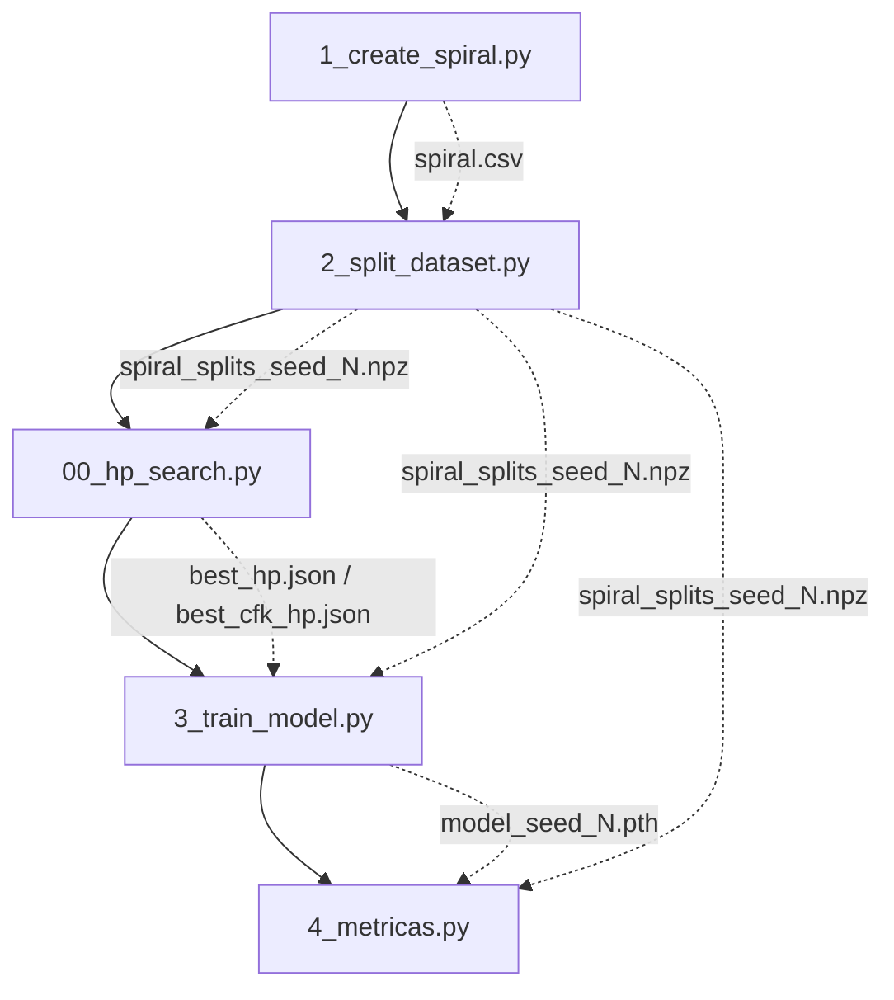

# 📋 Documentación Funcional — Pipeline del Benchmark

## Visión General

Este benchmark implementa un pipeline completo para evaluar técnicas de
**machine unlearning** sobre un dataset sintético de espirales entrelazadas.
El objetivo es entrenar un modelo base, definir un subconjunto de datos a
"olvidar" (forget set), y posteriormente aplicar y evaluar métodos de
unlearning.

## Arquitectura del Proyecto

```
benchmark/
├── doc/
│   └── pipeline.md              ← Este documento
├── models/
│   ├── base_nn.py               ← Definición del modelo BaseMLP
│   ├── weights/                 ← Pesos entrenados (.pth)
│   ├── best_hp.json             ← Mejores HP entrenamiento estándar (generado)
│   └── best_cfk_hp.json         ← Mejores HP desaprendizaje CFK (generado)
├── tests/
│   ├── conftest.py              ← Configuración compartida de pytest
│   ├── test_base_nn.py          ← Tests del modelo
│   ├── test_create_spiral.py    ← Tests de generación del dataset
│   ├── test_split_dataset.py    ← Tests de partición
│   ├── test_hp_search.py        ← Tests de la búsqueda generalizada de HP
│   ├── test_train_model.py      ← Tests del entrenamiento y unlearning
│   └── test_metricas.py         ← Tests del cálculo de métricas (RR/RF/RT)
├── utils/
│   ├── config.py                ← Configuración centralizada (rutas)
│   ├── hp_spaces.py             ← Registro de espacios de búsqueda Optuna
│   └── protocols.py             ← Protocolos de entrenamiento/olvido
├── datasets/                    ← Datos generados (CSV, NPZ)
├── results/                     ← Métricas en formato JSON (generado)
├── 1_create_spiral.py           ← Paso 1: Generar dataset
├── 2_split_dataset.py           ← Paso 2: Particionar dataset
├── 00_hp_search.py              ← Paso 2.5: Búsqueda generalizada de HP (Optuna)
├── 3_train_model.py             ← Paso 3: Entrenar o desentrenar modelo
└── 4_metricas.py                ← Paso 4: Evaluar métricas (ratios relativos)
```

---

## Pipeline de Ejecución

El pipeline se ejecuta en orden secuencial. Cada paso genera artefactos que son consumidos por los pasos posteriores.



---

## Paso 1 — Generación del Dataset (`1_create_spiral.py`)

### Propósito
Genera un dataset sintético de **espirales entrelazadas** en 2D con N clases.

### Parámetros principales
| Parámetro | Valor por defecto | Descripción |
|-----------|-------------------|-------------|
| `n_points_per_class` | 400 | Puntos por espiral |
| `n_classes` | 3 | Número de espirales/clases |
| `noise` | 0.45 | Ruido angular (desviación estándar) |
| `rotations` | 2.5 | Vueltas completas de cada espiral |
| `random_state` | 42 | Semilla para reproducibilidad |

### Salida
- `datasets/spiral.csv` — CSV con columnas `x1, x2, label`

### Ejecución
```bash
python 1_create_spiral.py
```

---

## Paso 2 — Partición del Dataset (`2_split_dataset.py`)

### Propósito
Divide el dataset en **cuatro subconjuntos** para el benchmark de unlearning:

| Split | Descripción | Proporción aprox. |
|-------|-------------|-------------------|
| **Retain** | Datos que el modelo debe mantener | ~57% |
| **Forget** | Datos a olvidar (solo clase 0, cercanos al centro) | ~14% |
| **Validation** | Evaluación durante entrenamiento | ~8% |
| **Test** | Evaluación final | ~20% |

### Estrategia de Forget
El forget set se construye seleccionando las muestras de la **clase 0** más cercanas al **centro de la espiral** (menor radio). Esto simula un escenario realista donde se quiere eliminar un subgrupo coherente y espacialmente localizado de los datos de entrenamiento.

### Salida
- `datasets/spiral_splits_seed_{N}.npz` — Archivo NumPy comprimido con las 8 arrays: `X_retain, y_retain, X_forget, y_forget, X_val, y_val, X_test, y_test`

### Ejecución
```bash
python 2_split_dataset.py
```

---

## Paso 2.5 — Búsqueda Generalizada de Hiperparámetros (`00_hp_search.py`)

### Propósito
Encuentra la mejor combinación de hiperparámetros para un protocolo específico (ej: entrenamiento estándar o desaprendizaje CFK) utilizando **Optuna** con pruning automático (`MedianPruner`).
La lógica de los espacios de búsqueda y los tipos de objetivos se centraliza en [hp_spaces.py](file:///c:/Users/smbsa/Documents/UB/benchmark/utils/hp_spaces.py).

### Protocolos Soportados
1. **`standard`**: Optimiza hiperparámetros de entrenamiento del modelo completo (hidden_dim, lr, batch_size, epochs) minimizando la pérdida de validación (`val_loss`).
2. **`cfk`**: Optimiza hiperparámetros de desaprendizaje (lr, k) minimizando la discrepancia cuadrática de rendimiento (`unlearning_loss`) relativo al modelo Naive de referencia, con épocas fijas a 20.

### Ejecución
Para optimizar entrenamiento estándar:
```bash
python 00_hp_search.py --protocol standard --n_trials 30
```
Para optimizar desaprendizaje CFK:
```bash
python 00_hp_search.py --protocol cfk --n_trials 30
```

---

## Paso 3 — Entrenamiento y Desentrenamiento del Modelo (`3_train_model.py`)

### Propósito
Entrena o desentrena cualquier modelo configurando dinámicamente su arquitectura, protocolo, splits y hiperparámetros.

### Protocolos de Unlearning (Olvido)
- **`cfk`**: Congela el extractor de características y optimiza únicamente las últimas $K$ capas del clasificador por un número fijo de **20 épocas** sobre el conjunto `retain`.

### Ejecución
Para entrenar el modelo base:
```bash
python 3_train_model.py --model_name base --train_splits retain,forget
```

Para entrenar el modelo naive (modelo de referencia sin forget set):
```bash
python 3_train_model.py --model_name naive --train_splits retain
```

Para aplicar el protocolo de olvido CFK (20 epochs):
```bash
python 3_train_model.py --model_name cfk --protocol cfk --train_splits retain --pretrained_weights "models/weights/base_model_seed_{seed}.pth" --hp_file "models/best_cfk_hp.json"
```

---

## Paso 4 — Evaluación de Métricas de Olvido (`4_metricas.py`)

### Propósito
Calcula y reporta las precisiones absolutas y los ratios relativos respecto al modelo de referencia **Naive**.

### Ratios Calculados
Para cada modelo (Base, Naive, Unlearned) se obtienen:
1. **Retain Ratio (RR)**: Rendimiento relativo sobre el conjunto de retención.
   $$RR = \frac{\text{Accuracy}(M, D_{retain})}{\text{Accuracy}(M_{naive}, D_{retain})}$$
   *Valor ideal para el modelo Unlearned: $\sim 1.0$ (retención conservada).*

2. **Forget Ratio (RF)**: Rendimiento relativo sobre el conjunto a olvidar.
   $$RF = \frac{\text{Accuracy}(M, D_{forget})}{\text{Accuracy}(M_{naive}, D_{forget})}$$
   *Valor ideal para el modelo Unlearned: $\sim 1.0$ (olvido completado al nivel del modelo Naive).*

3. **Test Ratio (RT)**: Rendimiento relativo sobre el conjunto de test.
   $$RT = \frac{\text{Accuracy}(M, D_{test})}{\text{Accuracy}(M_{naive}, D_{test})}$$
   *Valor ideal para el modelo Unlearned: $\sim 1.0$ (generalización intacta).*

### Ejecución
```bash
python 4_metricas.py --unlearned_name cfk
```

---

## Tests

El proyecto incluye tests unitarios automatizados ejecutables mediante **pytest**:
```bash
pytest tests/ -v
```
