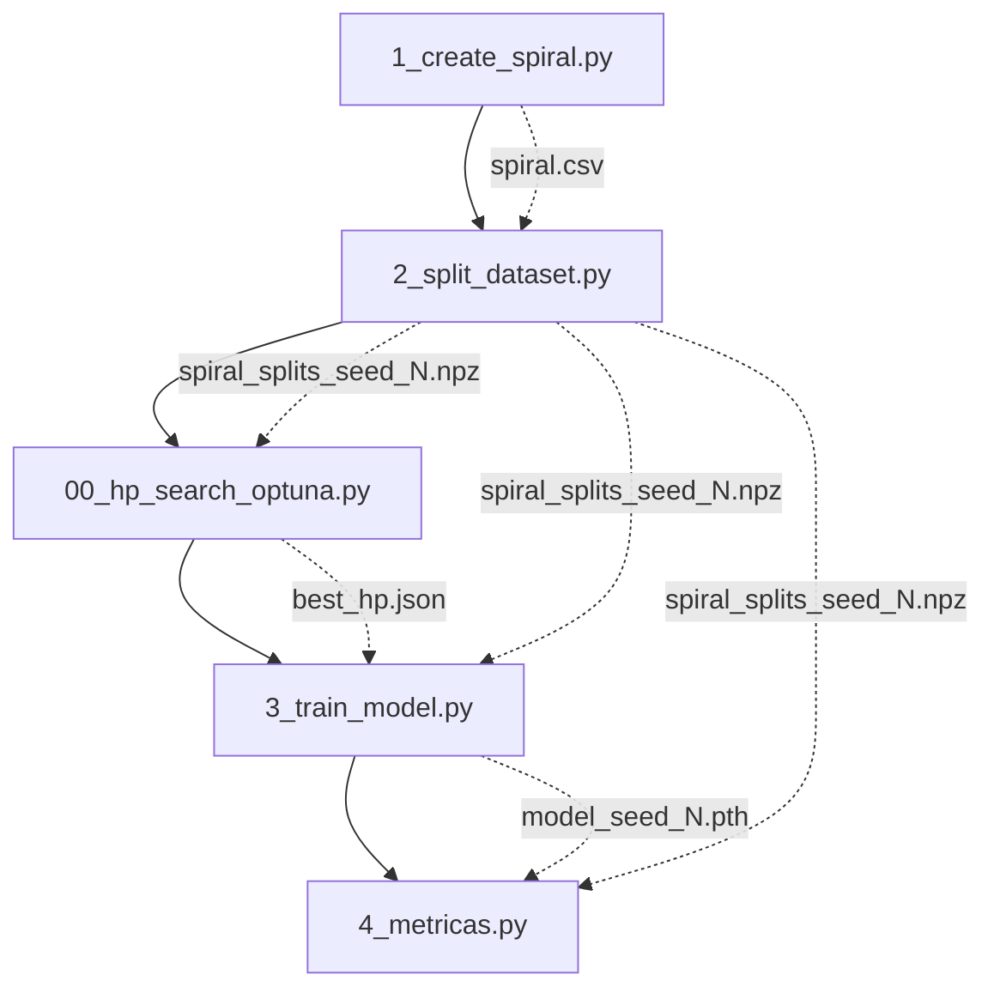

# 📋 Documentación Funcional — Pipeline del Benchmark

## Visión General

Este benchmark implementa un pipeline completo para evaluar técnicas de
**machine unlearning** sobre un dataset sintético de espirales entrelazadas.
El objetivo es entrenar un modelo base, definir un subconjunto de datos a
"olvidar" (forget set), y posteriormente aplicar y evaluar métodos de
unlearnin## Arquitectura del Proyecto

```
benchmark/
├── doc/
│   └── pipeline.md              ← Este documento
├── models/
│   ├── base_nn.py               ← Definición del modelo BaseMLP
│   ├── weights/                 ← Pesos entrenados (.pth)
│   └── best_hp.json             ← Mejores HP (generado por Optuna)
├── tests/
│   ├── conftest.py              ← Configuración compartida de pytest
│   ├── test_base_nn.py          ← Tests del modelo
│   ├── test_create_spiral.py    ← Tests de generación del dataset
│   ├── test_split_dataset.py    ← Tests de partición
│   ├── test_hp_search_optuna.py ← Tests de búsqueda de HP
│   ├── test_train_model.py      ← Tests del entrenamiento y unlearning
│   └── test_metricas.py         ← Tests del cálculo de métricas
├── utils/
│   ├── config.py                ← Configuración centralizada (rutas)
│   └── protocols.py             ← Protocolos de entrenamiento/olvido
├── datasets/                    ← Datos generados (CSV, NPZ)
├── results/                     ← Métricas en formato JSON (generado)
├── 1_create_spiral.py           ← Paso 1: Generar dataset
├── 2_split_dataset.py           ← Paso 2: Particionar dataset
├── 00_hp_search_optuna.py       ← Paso 2.5: Buscar hiperparámetros
├── 3_train_model.py             ← Paso 3: Entrenar o desentrenar modelo
├── 4_metricas.py                ← Paso 4: Evaluar métricas de unlearning
└── requirements.txt             ← Dependencias del proyecto
```

---

## Pipeline de Ejecución

El pipeline se ejecuta en orden secuencial. Cada paso genera artefactos que son consumidos por los pasos posteriores.



---

## Paso 1 — Generación del Dataset (`1_create_spiral.py`)

### Propósito
Genera un dataset sintético de **espirales entrelazadas** en 2D con N clases.

### Parámetros principales
| Parámetro | Valor por defecto | Descripción |
|-----------|-------------------|-------------|
| `n_points_per_class` | 400 | Puntos por espiral |
| `n_classes` | 3 | Número de espirales/clases |
| `noise` | 0.45 | Ruido angular (desviación estándar) |
| `rotations` | 2.5 | Vueltas completas de cada espiral |
| `random_state` | 42 | Semilla para reproducibilidad |

### Salida
- `datasets/spiral.csv` — CSV con columnas `x1, x2, label`

### Ejecución
```bash
python 1_create_spiral.py
```

---

## Paso 2 — Partición del Dataset (`2_split_dataset.py`)

### Propósito
Divide el dataset en **cuatro subconjuntos** para el benchmark de unlearning:

| Split | Descripción | Proporción aprox. |
|-------|-------------|-------------------|
| **Retain** | Datos que el modelo debe mantener | ~57% |
| **Forget** | Datos a olvidar (solo clase 0, cercanos al centro) | ~14% |
| **Validation** | Evaluación durante entrenamiento | ~8% |
| **Test** | Evaluación final | ~20% |

### Estrategia de Forget
El forget set se construye seleccionando las muestras de la **clase 0** más cercanas al **centro de la espiral** (menor radio). Esto simula un escenario realista donde se quiere eliminar un subgrupo coherente y espacialmente localizado de los datos de entrenamiento.

### Salida
- `datasets/spiral_splits_seed_{N}.npz` — Archivo NumPy comprimido con las 8 arrays: `X_retain, y_retain, X_forget, y_forget, X_val, y_val, X_test, y_test`

### Ejecución
```bash
python 2_split_dataset.py
```

---

## Paso 2.5 — Búsqueda de Hiperparámetros (`00_hp_search_optuna.py`)

### Propósito
Encuentra la mejor combinación de hiperparámetros para el modelo base usando **Optuna** con pruning automático (MedianPruner).

### Espacio de búsqueda
| Hiperparámetro | Tipo | Rango |
|----------------|------|-------|
| `hidden_dim` | Categórico | [8, 16, 32, 64, 128] |
| `lr` | Log-uniforme | [1e-4, 1e-1] |
| `batch_size` | Categórico | [16, 32, 64, 128] |
| `epochs` | Entero (paso 50) | [50, 300] |

### Métrica optimizada
- **Validation loss** (CrossEntropyLoss) — se minimiza.

### Pruning
Se usa `MedianPruner` con:
- `n_startup_trials=5`: los primeros 5 trials no se podan.
- `n_warmup_steps=20`: no se poda antes del epoch 20.

### Salida
- `models/best_hp.json` — JSON con los mejores HP encontrados.

### Ejecución
```bash
python 00_hp_search_optuna.py
```

---

## Paso 3 — Entrenamiento del Modelo (`3_train_model.py`)

### Propósito
Entrena cualquier modelo configurando dinámicamente su arquitectura, protocolo de entrenamiento/olvido, conjunto de splits y parámetros de hiperparámetros. 

Por defecto se entrena el modelo base original (`base_model_seed_{N}.pth`) con todos los datos (`retain` y `forget`), pero también permite entrenar el modelo ingenuo (`naive_model_seed_{N}.pth`) que excluye el split de `forget`, o correr un método de olvido como `cfk`.

### Parámetros principales (CLI)
| Parámetro | Valor por defecto | Descripción |
|-----------|-------------------|-------------|
| `--model_arch` | `models.base_nn.BaseMLP` | Import path de la clase del modelo a instanciar. |
| `--protocol` | `standard` | Protocolo de entrenamiento o unlearning a ejecutar (ej. `standard`, `cfk`). |
| `--train_splits` | `retain,forget` | Lista de splits separados por comas a incluir en el entrenamiento (ej. `retain` para naive). |
| `--model_name` | `base` | Prefijo para nombrar el archivo de pesos resultante en `models/weights/`. |
| `--hp_file` | `models/best_hp.json` | Ruta al archivo JSON de hiperparámetros generado por Optuna. |
| `--epochs` | *(Desde `hp_file` o `150`)* | Sobrescribe el número de épocas de entrenamiento. |
| `--batch_size` | *(Desde `hp_file` o `32`)* | Sobrescribe el tamaño de batch. |
| `--lr` | *(Desde `hp_file` o `1e-3`)* | Sobrescribe el learning rate. |
| `--hidden_dim` | *(Desde `hp_file` o `16`)* | Sobrescribe la dimensión oculta del modelo MLP. |
| `--seeds` | `0,1,2` | Semillas para las cuales entrenar el modelo, separadas por comas (ej. `0,1,2`). |
| `--pretrained_weights` | `None` | Ruta a los pesos pre-entrenados del modelo (admite `{seed}` para formateo). |
| `--k` | `1` | Número de últimas capas a descongelar para el protocolo `cfk`. |

### Salidas
- `models/weights/{model_name}_model_seed_{N}.pth` — State dict del modelo.

### Ejecución
Para entrenar el modelo base:
```bash
python 3_train_model.py --model_name base --train_splits retain,forget
```

Para entrenar el modelo naive:
```bash
python 3_train_model.py --model_name naive --train_splits retain
```

Para aplicar el protocolo de olvido CFK (fine-tuning congelando todo excepto el clasificador):
```bash
python 3_train_model.py --model_name cfk --protocol cfk --train_splits retain --pretrained_weights "models/weights/base_model_seed_{seed}.pth" --epochs 20 --k 1
```

---

## Paso 4 — Evaluación de Métricas de Olvido (`4_metricas.py`)

### Propósito
Calcula y reporta las precisiones (accuracy) absolutas de los modelos en todos los conjuntos de datos, así como las métricas relativas que evalúan la calidad del olvido y la retención.

### Métricas Calculadas
1. **Retain Accuracy (RA)**: Mide qué tan bien retiene el conocimiento que debe mantener, en comparación con un modelo que nunca vio los datos a olvidar:
   $$RA = \frac{\text{Accuracy}(M_{unlearned}, D_{retain})}{\text{Accuracy}(M_{naive}, D_{retain})}$$
   *Valor ideal: $\sim 1.0$ (indica que mantiene la misma precisión que el modelo Naive).*

2. **Forget Accuracy (FA)**: Mide qué tan bien ha olvidado la información, comparando su precisión en el conjunto de olvido con la de un modelo Naive (que nunca los vio):
   $$FA = \frac{\text{Accuracy}(M_{unlearned}, D_{forget})}{\text{Accuracy}(M_{naive}, D_{forget})}$$
   *Valor ideal: $\sim 1.0$ (indica que el rendimiento en el conjunto de olvido es equivalente al de una red que nunca conoció estos datos, es decir, ha desaprendido).*

### Salida
- Tabla detallada por pantalla con el promedio y desviación estándar.
- `results/{unlearned_name}_metrics.json` — Informe estructurado de las métricas.

### Ejecución
```bash
python 4_metricas.py --unlearned_name cfk
```

---

## Modelo Base — `BaseMLP` (`models/base_nn.py`)

### Arquitectura

```
┌─────────────────────────────────────────┐
│            feature_extractor            │
│  Linear(input_dim, hidden_dim) → ReLU   │
│  Linear(hidden_dim, hidden_dim) → ReLU  │
├─────────────────────────────────────────┤
│              classifier                 │
│  Linear(hidden_dim, output_dim)         │
└─────────────────────────────────────────┘
```

---

## Tests

El proyecto incluye tests unitarios con **pytest** para cada componente:

| Fichero | Componente testeado | Nº tests |
|---------|---------------------|----------|
| `test_base_nn.py` | Arquitectura y forward pass del modelo | 11 |
| `test_create_spiral.py` | Generación del dataset espiral | 10 |
| `test_split_dataset.py` | Partición y forget set | 11 |
| `test_hp_search_optuna.py` | Búsqueda de hiperparámetros | 13 |
| `test_train_model.py` | Entrenamiento, checkpoints y CFK | 13 |
| `test_metricas.py` | Carga, evaluación y cálculo de RA/FA | 6 |

### Ejecución
```bash
pytest tests/ -v
```

---

## Flujo Completo — Quick Start

```bash
# 1. Generar el dataset espiral
python 1_create_spiral.py

# 2. Crear los splits (retain/forget/val/test)
python 2_split_dataset.py

# 3. Buscar los mejores hiperparámetros (opcional)
python 00_hp_search_optuna.py

# 4. Entrenar modelo base (Completo) y modelo naive (Solo Retain)
python 3_train_model.py --model_name base --train_splits retain,forget
python 3_train_model.py --model_name naive --train_splits retain

# 5. Aplicar protocolo de olvido CFK (k=1) sobre el modelo base
python 3_train_model.py --model_name cfk --protocol cfk --train_splits retain --pretrained_weights "models/weights/base_model_seed_{seed}.pth" --epochs 20 --k 1

# 6. Evaluar métricas de olvido (RA y FA) para CFK
python 4_metricas.py --unlearned_name cfk

# 7. Ejecutar tests unitarios
pytest tests/ -v
```


